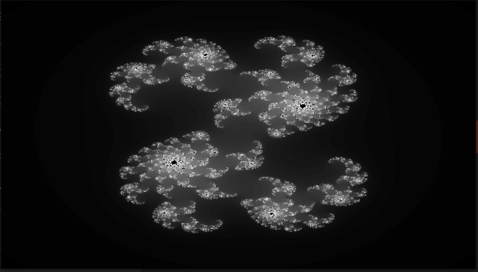
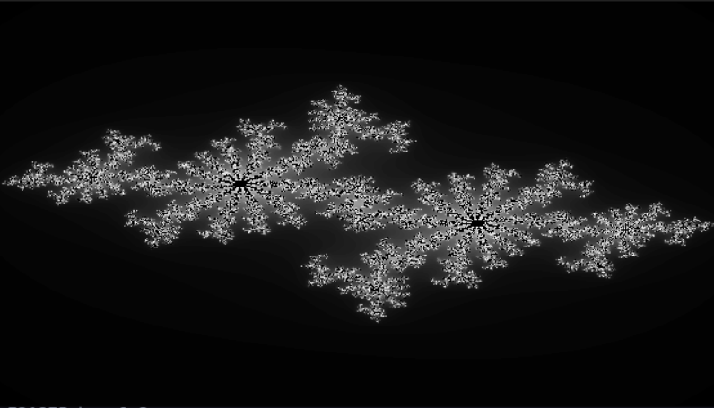

# TODAY'S TASK: Julia Set

STARTING: 2024-11-26 13:13

ENDED: 2024-11-29 11:34

(The plan was doing it in python, but it wasn't fast enough, so I had to quickly learn OpenGL in C++)

## Introduction

This repository is a submodule of a challenges repository.
Today's task is to generate and visualize the Julia Set.
To see more challenges, visit the [DailyChallenges](https://github.com/RodrigoAroeira/DailyChallenges) repository.

This specific challenge was inspired by the [Coding Train](https://youtube.com/@TheCodingTrain)'s [video](https://youtu.be/fAsaSkmbF5s?si=JkNiZvWralzD6iZX) on the subject,
and this is my take on it.

## Julia Set

### What is a Julia Set?

The Julia Set function can be defined as:

$$
f(z) = z^2 + c
$$

where `z` and `c` are complex numbers. The Julia Set is created by iterating the
function over the complex plane and determining which points converge to a
fixed value, and which points diverge to infinity. After an arbitrary number of
iterations, if the magnitude of z is less than 2, then the point is considered
to be in the Julia Set.

The more famous Mandelbrot Set could be considered a special case of the Julia Set,
because it uses different `c` values for each point in the mapping. In other words,
the Mandelbrot Set is a collection of all Julia Sets around their origins.

## What's next?

I still want to improve the code's performance, so it doesn't take as long
on the sets that have more points reaching the max iterations.

Additionally, I want to add color to the visualization.

## References

<https://en.wikipedia.org/wiki/Mandelbrot_set>

<https://en.wikipedia.org/wiki/Julia_set>

<https://www.karlsims.com/julia.html>
